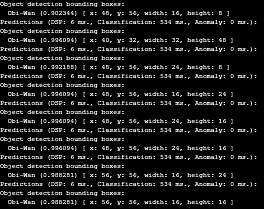
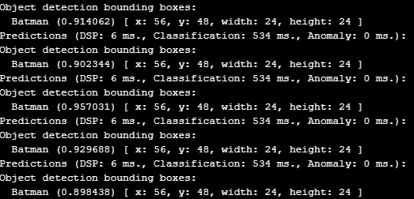
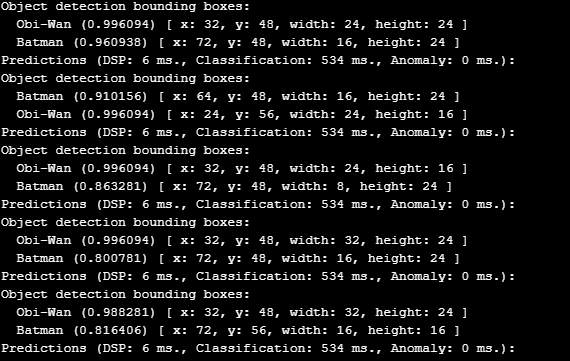

# ESP32-CAM Object Detection: Obi-Wan Kenobi vs Batman - Ashalen Govender

This project uses an ESP32-CAM and a custom Edge Impulse model to detect two LEGO figures: **Obi-Wan Kenobi** and **Batman**.

The model was trained using Edge Impulse, with images captured using a phone and labelled in Edge Impulse. The detection runs directly on the ESP32-CAM and displays results in the Arduino IDE serial monitor — no SD card or cloud required.

## Purpose

This repo was built to showcase:

- Embedded AI on the ESP32-CAM  
- Image collection and model training using Edge Impulse  
- Real-time object recognition on-device (no SD card or external storage)

It's part of my personal portfolio and not intended as a tutorial.

## Results

| Obi-Wan Detected | Batman Detected |
|------------------|-----------------|
|  |  |  |

## Model

The Edge Impulse model is located in the `ESP32_CAM_LEGO/Model/ei-esp32-cam-object-detection-lego-figures-ashalen-govender-object-detection-tensorflow-lite-int8-quantized-model.3.lite` folder.

## 📄 Code

The Arduino sketch is located in `ESP32_CAM_LEGO/code/esp32_cam_detection_script/esp32_cam_detection_script.ino`.

It uses the Edge Impulse inference SDK to run object detection directly on the ESP32-CAM. No additional storage or cloud connection is needed.

## Notes

This project is for demo and showcase purposes only.

No wiring diagrams or build tutorials are included — just the essentials: code, model, and example results.

## Credits

Built by **Ashalen Govender**  
BSc Robotics | Robotics and AI Enthusiast  
[LinkedIn](https://www.linkedin.com/in/ashalen-govender/)

